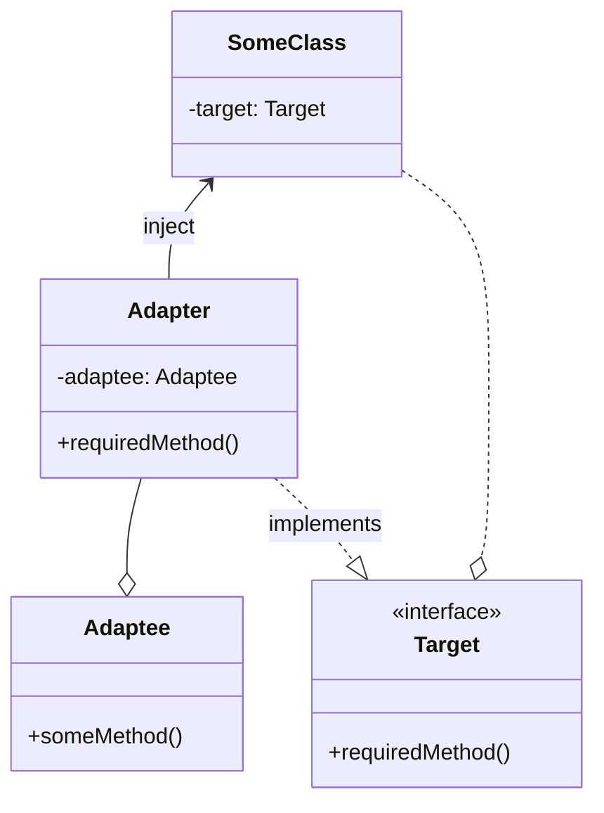

# Adapter パターン

```mermaid
classDiagram

class SomeClass {
  -target: Target
}

class Adapter {
  -adaptee: Adaptee
  +requiredMethod()
}

class Target {
  +requiredMethod()
}
<<interface>> Target

class Adaptee {
  +someMethod()
}

Adapter --o Adaptee
Adapter ..|> Target : implements
SomeClass <-- Adapter : inject
SomeClass ..o Target
```
