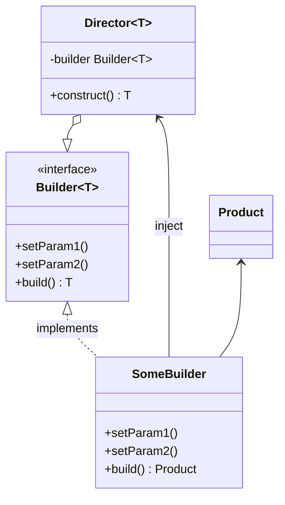

# Builder パターン

```mermaid
classDiagram

class Director~T~ {
  -builder Builder~T~
  +construct() T
}

class Builder~T~ {
  +setParam1()
  +setParam2()
  +build() T
}
<<interface>> Builder

class SomeBuilder {
  +setParam1()
  +setParam2()
  +build() Product
}

class Product

Director o--|> Builder
Builder <|.. SomeBuilder : implements
Director <-- SomeBuilder : inject
Product <-- SomeBuilder
```
