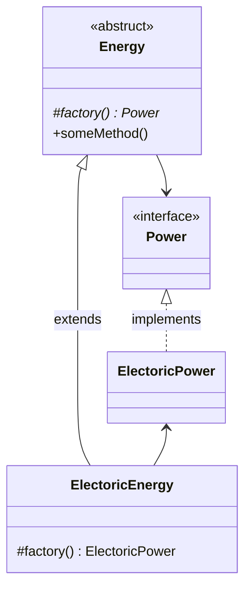

# Factory Method パターン

```mermaid
classDiagram

class Energy {
  #factory()* Power
  +someMethod()
}
<<abstruct>> Energy

class Power
<<interface>> Power

class ElectoricEnergy {
  #factory() ElectoricPower
}

class ElectoricPower

Energy <|-- ElectoricEnergy : extends
Energy --> Power
Power <|.. ElectoricPower : implements
ElectoricPower <-- ElectoricEnergy
```
