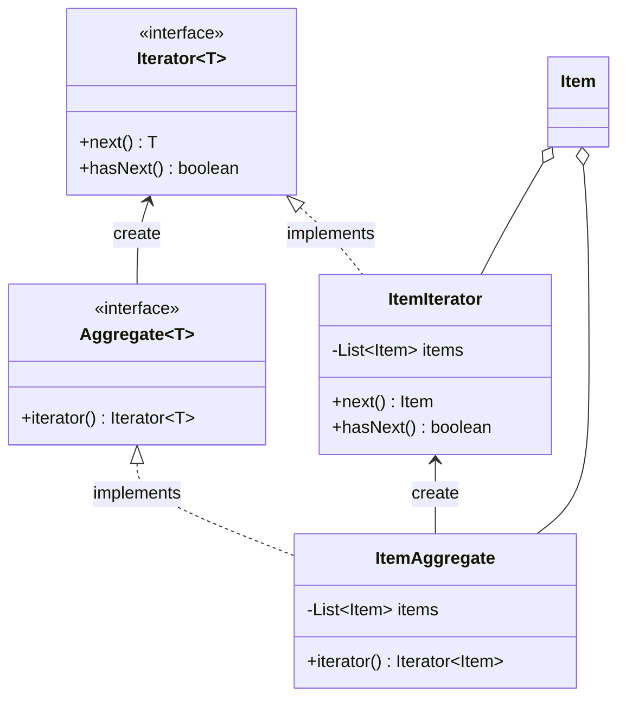

# Iterator パターン

```mermaid
classDiagram

class Aggregate~T~ {
  +iterator() Iterator~T~
}
<<interface>> Aggregate

class Iterator~T~ {
  +next() T
  +hasNext() boolean
}
<<interface>> Iterator

class Item

class ItemAggregate {
  -List~Item~ items
  +iterator() Iterator~Item~
}

class ItemIterator {
  -List~Item~ items
  +next() Item
  +hasNext() boolean
}

Iterator <-- Aggregate : create
Aggregate <|.. ItemAggregate: implements
ItemIterator <-- ItemAggregate : create
Iterator <|.. ItemIterator: implements
Item o-- ItemAggregate
Item o-- ItemIterator
```
