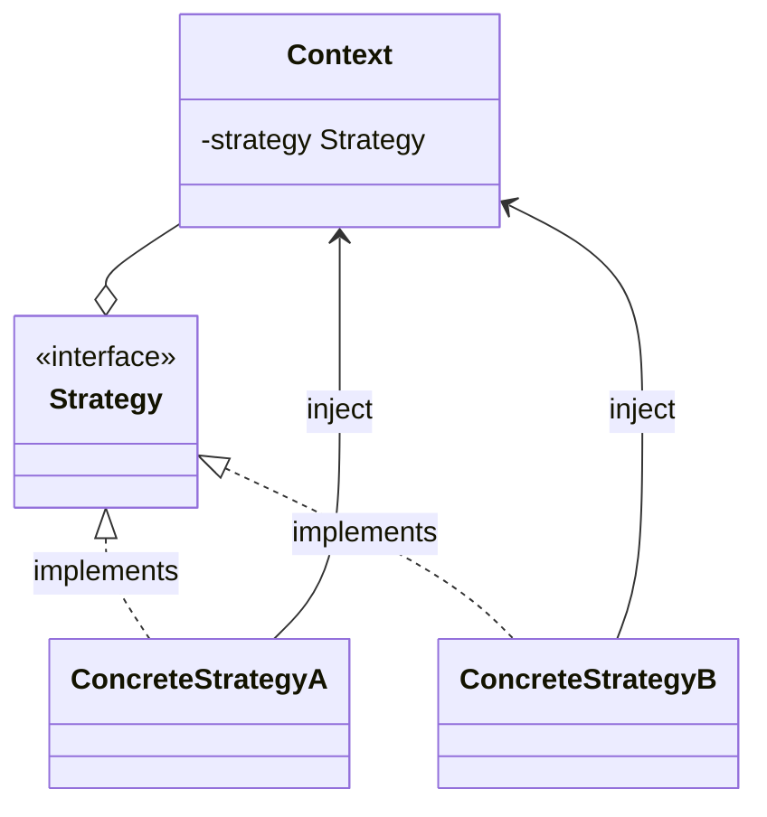

# Strategy パターン

```mermaid
classDiagram

class Context {
  -strategy Strategy
}

class Strategy
<<interface>> Strategy

class ConcreteStrategyA

class ConcreteStrategyB

Context --o Strategy
Strategy <|.. ConcreteStrategyA : implements
Strategy <|.. ConcreteStrategyB : implements
Context <-- ConcreteStrategyA : inject
Context <-- ConcreteStrategyB : inject
```
