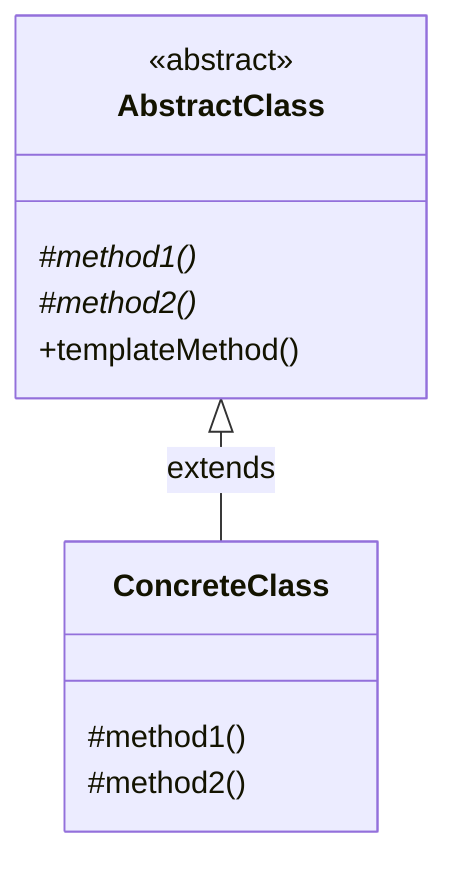

# Template Method パターン

```mermaid
classDiagram

class AbstractClass {
  #method1()*
  #method2()*
  +templateMethod()
}
<<abstract>> AbstractClass

class ConcreteClass {
  #method1()
  #method2()
}

AbstractClass <|-- ConcreteClass : extends
```
